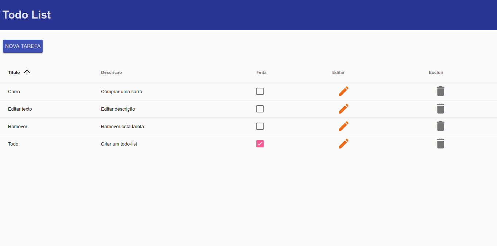

## Todo-list com NodeJs e Angular

Esta aplicação foi criada como um teste para a empresa [Sthima](https://www.sthima.com.br/).

### Instalação

* verifique se a versão do [Node.js](https://nodejs.org) instalada é no mínimo a 6.11.2 com o comando `node --version`
* clone ou faça o download  do repositório 
* digite o comando `npm install` no terminal.

### Iniciando a aplicação

Após entrar com o comando `npm start` no terminal o sistema estará disponível na url: `localhost:8080`

* Clique no botão `nova tarefa` para criar uma nova tarefa
* Clique em uma linha da coluna `Feita` da tabela para marcar uma tarefa como feita
* Clique em uma linha da coluna `Editar` para editar uma tarefa
* Clique em uma linha da coluna `Excluir` para excluir uma tarefa
* Clique no cabeçalho da coluna `Titulo` ou `Descrição` para ordenar a tabela de acordo com os respectivos campos.

### Sobre o sistema

O sistema é iniciado pelo `server.js`, neste arquivo estão as instruções para iniciar o servidor, os routers e a localização do frontend.

O corpo do backend está dentro da pasta `app`
dentro de `app/routers/rest.js` está a api rest do sistema com o CRUD de tarefas. O banco está em `app/db`

O frontend foi feito com [AngularJs](https://angularjs.org/) e está na pasta `public/app` A maior parte da implementação está dentro de `public/app/tarefas` onde estão os controllers, services e views da tarefa.

### Testes unitários
Os testes unitários foram feitos apenas para o backend e estão localizados na pasta `/test` do projeto e podem ser ativados pelo comando `npm test`.
Todos os testes chamam um endpoint da api e verificam se o express está recebendo e passando os parâmetros para o [moongose](http://mongoosejs.com/) corretamente.

